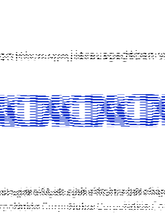

# KA3D Tools
This app is a tool to convert KA3D/Fusion Engine assets back to their general format:

1. .ntx -> Img/Tex -> .png/.jpg/.tiff
2. .hgr -> Assets/Objects

[NOTE: not all .hgr files (KA3D engine's gamedata, leveldata, prefabs, etc.) can be directly converted into existing files]

# Downloads
[Windows](https://github.com/sb-nes/KA3D_Tools/releases/tag/v0.1.5-beta-release)

## a little error i made in v0.1

What it looked like: &nbsp; &nbsp; &nbsp; &nbsp; &nbsp; &nbsp; &nbsp; &nbsp; &nbsp; &nbsp; &nbsp; &nbsp; What it should look like:

